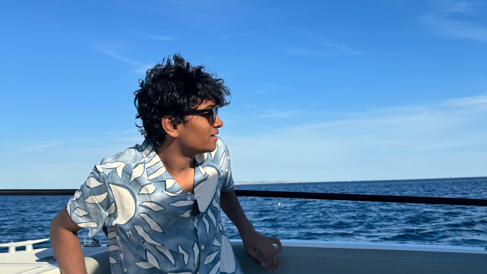

# about me

I'm a 3rd year Computer Science Student at Georgia Tech specializing in the Intelligence and People threads. 
As an Indian male in CS at Georgia Tech I consider myself a very rare breed 😇.

I became interested in CS because I love immersing myself in projects and building things that I can see working in real-time. 
My experience is mainly in full-stack development, and data analysis/ML in Python. I've found that I work best under pressure, and need to understand the "why" behind my work in order to do my best.

I have a dog Meru, who absolutely adores me whenever I have food to give her. Otherwise, she fondly tolerates my presence.

### sportsball

<strong>The teams I support</strong>

<ul>
<li>FC Barcelona</li>
<li>Wherever LeBron is</li>
<li>Arsenal FC</li>
<li>Atlanta Hawks</li>
<li>Atlanta Falcons</li>
<li>Scuderia Ferrari</li>

 

At an impresionable age, I (correctly) decided that Lionel Messi and LeBron James are the GOATs, so I currently support the 76ers (don't love that I have to), and FC Barcelona.

I was born and raised in the Metro Atlanta Area and I enjoyed watching the Falcons play until 28-3 happened. 
Recently, I've renewed my interest in the NFL, but I'm not having as fun of a time as I used to watching the Falcons.
I also recently started watching F1 and unfortunately fell into the trap of being a Ferrari fan. It's pretty miserable.

 

Other Interests

<ul>
<li>Poker</li>
<li>Urban Planning</li>
<li>Hobby DJ-ing</li>
<li>Instagram Reels</li>
</ul>

